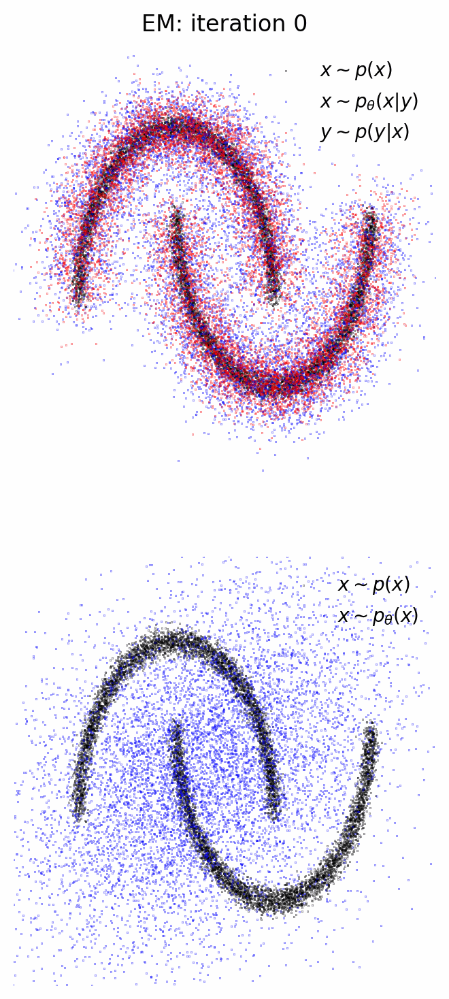

<h1 align='center'>Diffusion priors from observations with expectation maximization</h1>

Implementation of [Learning Diffusion Priors from Observations by Expectation Maximization](https://arxiv.org/abs/2405.13712) in `jax` and `equinox`.

In this implementation I am only dealing with Gaussian noise on the data, perhaps I will add support for linear corruption operators soon.

To implement:
- [x] Flow matching
- [x] Stochastic and deterministic posterior sampling
- [ ] Mixed precision
- [x] EMA
- [ ] Hyperparameter/model saving
- [ ] CG data-likelihood calculation ($q_0(x|y)$ as well as $q(x|y)$)

<div align="center">
    
</div>

```bibtex
@misc{rozet2024learningdiffusionpriorsobservations,
      title={Learning Diffusion Priors from Observations by Expectation Maximization}, 
      author={François Rozet and Gérôme Andry and François Lanusse and Gilles Louppe},
      year={2024},
      eprint={2405.13712},
      archivePrefix={arXiv},
      primaryClass={cs.LG},
      url={https://arxiv.org/abs/2405.13712}, 
}
```