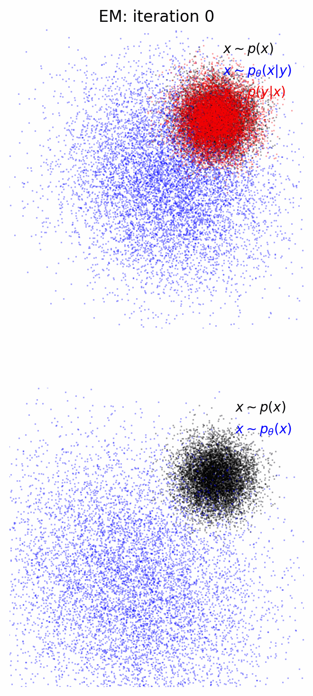

<h1 align='center'>Diffusion priors from observations with expectation maximization</h1>

Implementation of [Learning Diffusion Priors from Observations by Expectation Maximization](https://arxiv.org/abs/2405.13712) in `jax` and `equinox`.

Added flow matching with rectified flows to improve the convergence of the EM optimisation.

In this implementation I am only dealing with Gaussian noise on the data, perhaps I will add support for linear corruption operators soon.

To implement:
- [x] Flow matching
- [x] Stochastic and deterministic posterior sampling
- [ ] Mixed precision
- [x] EMA
- [ ] Hyperparameter/model saving
- [ ] CG data-likelihood calculation 

<div align="center">
    
</div>

## Citations

```bibtex
@misc{rozet2024learningdiffusionpriorsobservations,
      title={Learning Diffusion Priors from Observations by Expectation Maximization}, 
      author={François Rozet and Gérôme Andry and François Lanusse and Gilles Louppe},
      year={2024},
      eprint={2405.13712},
      archivePrefix={arXiv},
      primaryClass={cs.LG},
      url={https://arxiv.org/abs/2405.13712}, 
}
```

```bibtex
@misc{liu2022flowstraightfastlearning,
      title={Flow Straight and Fast: Learning to Generate and Transfer Data with Rectified Flow}, 
      author={Xingchao Liu and Chengyue Gong and Qiang Liu},
      year={2022},
      eprint={2209.03003},
      archivePrefix={arXiv},
      primaryClass={cs.LG},
      url={https://arxiv.org/abs/2209.03003}, 
}
```

```bibtex
@misc{lipman2023flowmatchinggenerativemodeling,
      title={Flow Matching for Generative Modeling}, 
      author={Yaron Lipman and Ricky T. Q. Chen and Heli Ben-Hamu and Maximilian Nickel and Matt Le},
      year={2023},
      eprint={2210.02747},
      archivePrefix={arXiv},
      primaryClass={cs.LG},
      url={https://arxiv.org/abs/2210.02747}, 
}
```